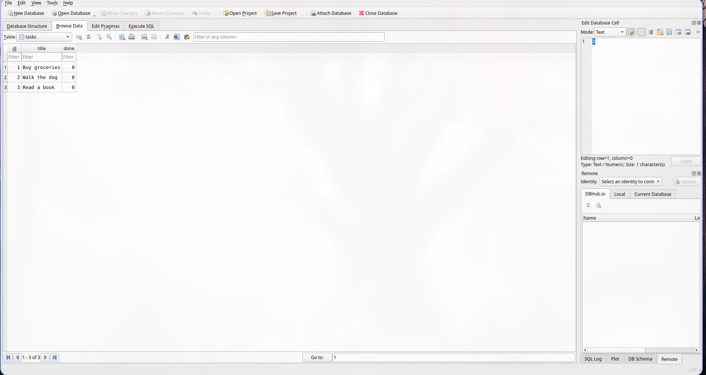

# Week 2 API — Task Manager

## Why SQLite?

- **Single file** — the entire database is one `task.db` file, no server process to install or configure compared to other db like postgres or connecting to a cloud db provider.
- **Zero setup** — Python ships with `sqlite3` in the standard library, so there are no extra dependencies.
- **Survives restarts** — the data persists on disk between runs, unlike an in-memory store.

## Where the Database Lives

The database file is `task.db`, created automatically at startup inside the `src/` directory. It is listed in `.gitignore` so each clone starts fresh with no stale data.

## Getting Started
1. Create a virtual environment using 
```bash
python -m venv .venv
```
2. Activate the environment
```bash
source .venv/bin/activate
```
3. Start the project
```bash
cd src && python app.py
```

The server starts on `http://127.0.0.1:4000`. On first run it creates `task.db`, builds the `tasks` table, and seeds three example tasks.
## Note
You can change the port to whatever you want
## Example SQL Query (Stage 4)

```sql
SELECT * FROM tasks;
```

This returned all rows from the tasks table:

| id | title          | done |
|----|----------------|------|
| 1  | Buy groceries  | 0    |
| 2  | Walk the dog   | 0    |
| 3  | Read a book    | 0    |

## Database Screenshot



