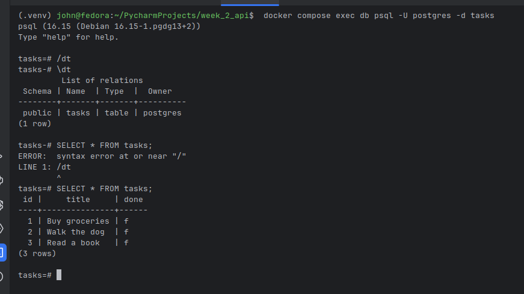

# Task API — A3 Containers

A RESTful Task API built with FastAPI, PostgreSQL, and Docker. One command spins up the full stack — API server, database, schema creation, and seeded data.

## Quick Start

```bash
cp .env.example .env
docker compose up --build
```

The API is available at `http://localhost:3000`.

## Environment Variables

Copy `.env.example` to `.env` and fill in your values:

| Variable | Description | Example |
|---|---|---|
| `POSTGRES_PASSWORD` | Database password | `dev` |
| `POSTGRES_DB` | Database name | `tasks` |
| `DATABASE_URL` | Full connection string (used by the API) | `postgres://postgres:dev@db:5432/tasks` |

> When running via Docker Compose, these are set automatically in `compose.yaml`. Only edit `.env` if you need to change them.

## Endpoints

| Method | Path | Description |
|--------|------|-------------|
| GET | `/` | API info |
| GET | `/hello` | Hello world test |
| GET | `/health` | Health check |
| GET | `/tasks` | List all tasks |
| GET | `/tasks/{id}` | Get task by ID |
| GET | `/tasks/?title=query` | Search tasks by title |
| POST | `/tasks` | Create a new task |
| PUT | `/tasks/{id}` | Update a task |
| DELETE | `/tasks/{id}` | Delete a task |

## Example curl

```bash
curl -i http://localhost:3000/tasks
```

## Database

Connect to the running database:

```bash
docker compose exec db psql -U postgres -d tasks
```

```sql
\tasks
SELECT * FROM tasks;
```


