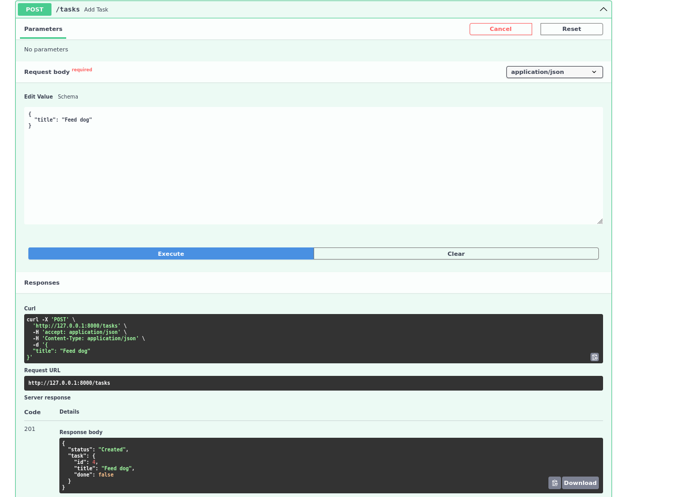
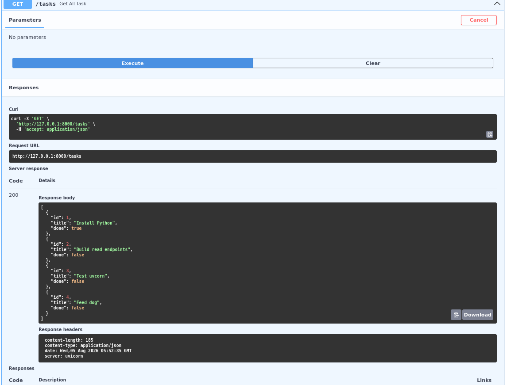
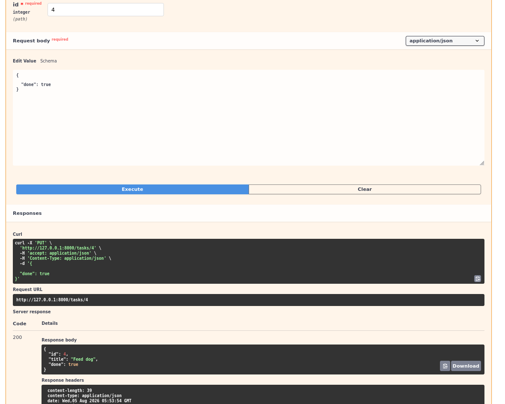
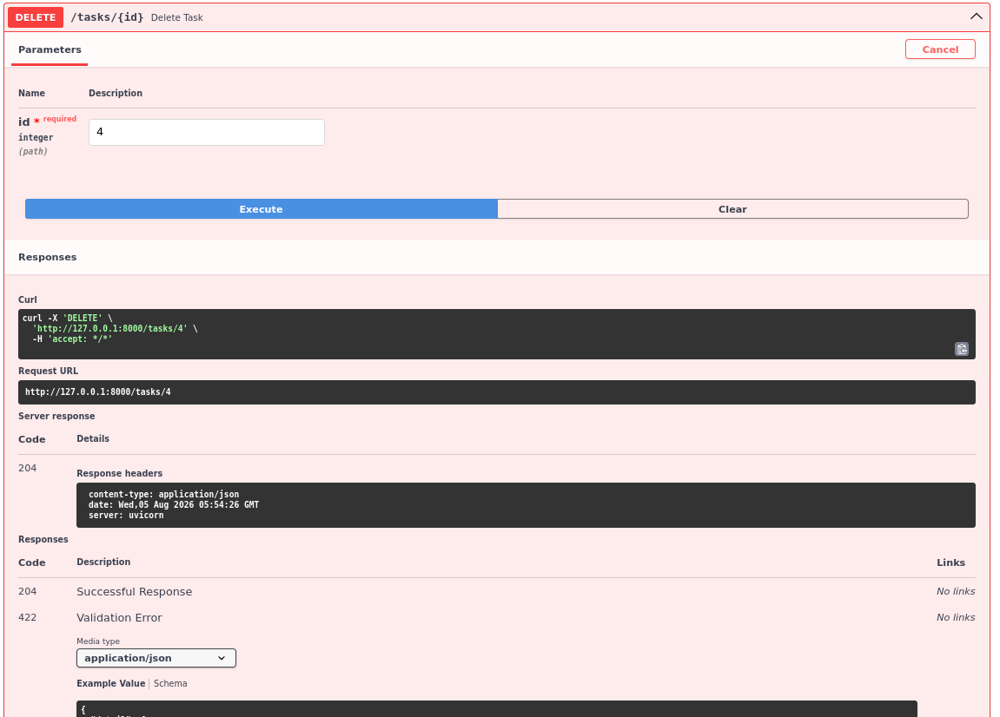

# Task API

A minimal FastAPI CRUD server for an in-memory task list.

## Run
```bash
# from this directory
python -m venv .venv && source .venv/bin/activate
pip install -r requirements.txt
uvicorn main:app --reload
```

The server starts on `http://localhost:8000`. Swagger UI is at `http://localhost:8000/docs`.

## Endpoints

| Method | Path           | Status | Description                      |
|--------|----------------|--------|----------------------------------|
| GET    | `/tasks`       | 200    | List all tasks                   |
| GET    | `/tasks/:id`   | 200    | Get one task                     |
| POST   | `/tasks`       | 201    | Create a task (`{"title": "..."}`) |
| PUT    | `/tasks/:id`   | 200    | Update title and/or done flag    |
| DELETE | `/tasks/:id`   | 204    | Delete a task                    |

Errors: `400` for a missing/empty title or invalid body, `404` for an unknown id — always with a JSON error body like `{"detail": "..."}`.

## Example

```text
$ curl -i -X POST http://localhost:8000/tasks -H 'Content-Type: application/json' -d '{"title":"Sample task"}'
HTTP/1.1 201 Created
date: Wed, 05 Aug 2026 06:04:37 GMT
server: uvicorn
content-length: 71
content-type: application/json

{"status":"Created","task":{"id":6,"title":"Sample task","done":false}}
```

## Screenshots







## The mortality experiment
I have inputted sevaral tasks on both swagger UI and curl, when I havent restarted the server the tasks are still there, but everytime I restart the server the state or the data that I have put is gone. I think because we dont have a database and is relying on the computer's memory there is no permanent or persistent storage for the data.
