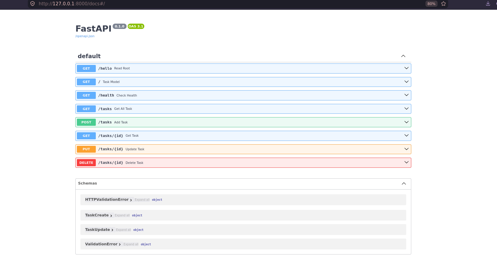

# Task API

A FastAPI CRUD server for an in-memory task list. No database — data lives in memory for the lifetime of the process, so it resets on restart.

## Install & Run

```bash
# from this directory (ai/)
python -m venv .venv && source .venv/bin/activate
pip install -r requirements.txt
uvicorn main:app --reload
```

The server starts on `http://localhost:8000`. Swagger UI is at `http://localhost:8000/docs`.

## Task Model

```json
{
  "id": 1,
  "title": "Complete assignment",
  "done": false
}
```

| Field | Type    | Rules                                   |
|-------|---------|-----------------------------------------|
| id    | Integer | Auto-generated, unique                  |
| title | String  | Required, cannot be empty or whitespace |
| done  | Boolean | Defaults to `false`                     |

## Endpoints

| Method | Route          | Description      | Status |
|--------|----------------|------------------|--------|
| POST   | `/tasks`       | Create a task    | 201    |
| GET    | `/tasks`       | Get all tasks    | 200    |
| GET    | `/tasks/{id}`  | Get a task by ID | 200    |
| PUT    | `/tasks/{id}`  | Update a task    | 200    |
| DELETE | `/tasks/{id}`  | Delete a task    | 204    |

## Requests & Responses

### POST /tasks — Create

```bash
curl -X POST http://localhost:8000/tasks -H 'Content-Type: application/json' -d '{"title":"Complete assignment"}'
```

```json
// 201 Created
{"id":1,"title":"Complete assignment","done":false}
```

Errors:
- `400` — empty/whitespace title: `{"detail":"Title is required and cannot be empty or whitespace"}`
- `422` — missing title, wrong type, or extra fields

### GET /tasks — List all

```bash
curl http://localhost:8000/tasks
```

```json
// 200 OK
[{"id":1,"title":"Complete assignment","done":false}]
```

### GET /tasks/{id} — Get one

```bash
curl http://localhost:8000/tasks/1
```

```json
// 200 OK
{"id":1,"title":"Complete assignment","done":false}
```

Error: `404` — `{"detail":"Task 999 not found"}`

### PUT /tasks/{id} — Update

```bash
curl -X PUT http://localhost:8000/tasks/1 -H 'Content-Type: application/json' -d '{"title":"Finished assignment","done":true}'
```

```json
// 200 OK
{"id":1,"title":"Finished assignment","done":true}
```

Errors: `400` for empty title, `404` for unknown id, `422` for wrong types.

### DELETE /tasks/{id} — Delete

```bash
curl -X DELETE http://localhost:8000/tasks/1
```

```text
// 204 No Content (empty body)
```

Error: `404` — `{"detail":"Task 999 not found"}`

## Error Handling

| Scenario            | Status | Body                                          |
|---------------------|--------|-----------------------------------------------|
| Invalid request     | 400    | `{"detail":"Title is required and cannot be empty or whitespace"}` |
| Validation failure  | 422    | `{"detail":[{"type":"...","loc":["body","title"],"msg":"...","input":...}]}` |
| Task not found      | 404    | `{"detail":"Task 999 not found"}`             |
| Internal error      | 500    | `{"error":"Internal server error"}`           |

## Screenshots


